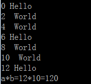
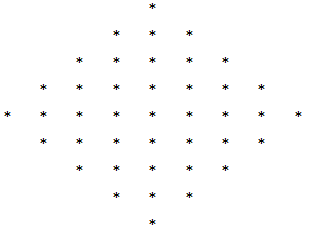

# day04_课后练习

## 第一题

* 语法点：运算符，while，if

* 按步骤编写代码，效果如图所示：

  

  

* 编写步骤：

  1. 定义类 Test1
  2. 定义 main方法
  3. 定义变量i为0,i2为10
  4. 使用第一个while循环,当条件为`i小于5` 时,则进入循环
  5. 循环内,i自增,i2自增
  6. 循环内,使用if判断,当`i大于等于 2 ` 并且` i2小于15` 时,同时输出i和i2的值
  7. 使用第二个while循环,当条件为`i2小于20` 时,则进入循环
  8. 循环内,i自增,i2自增
  9. 循环内,使用if判断,当`i大于8 ` 或者`i2小于等于18` 时,同时输出i和i2的值

```java
public class Test01 {
	public static void main(String[] args) {
		int i = 0;
		int i2 = 10;
		while(i<5){
			i++;
			i2++;
			if(i>=2 && i2<15){
				System.out.println("i:" + i + ",i2:" + i2);
			}
		}
		System.out.println("----------------------");
		while(i2<20){
			i++;
			i2++;
			if(i>8 || i2<=18){
				System.out.println("i:" + i + ",i2:" + i2);
			}
		}
	}
}

```


## 第二题

* 语法点：方法，运算符，for，while 

* 按步骤编写代码，效果如图所示：

  

* 编写步骤

1. 定义类 Test2，定义 main方法

2. main方法中,定义int类型变量 a为1

3. 使用while循环,判断a<=5,进入循环.

4. while循环内部,使用for循环,初始化int类型变量b为1,当b<=5时进入循环, 步进表达式b++

5. for循环内,不换行输出i并拼接" "

6. for循环外,输出换行.

7. for循环外,a自增.

```java
public class Test02 {
	public static void main(String[] args) {
		int a = 1;
		System.out.println("--------------------------");
		while(a<=5){
			for (int b = 1; b <= 5; b++) {
				System.out.print(b+" ");
			}
			System.out.println();
			a++;
		}
		System.out.println("--------------------------");
	}
}

```


## 第三题

* 语法点：运算符，for，if

* 按步骤编写代码，效果如图所示：

  

* 编写步骤

  1. 定义类 Test5
  2. 定义 main方法
  3. 定义变量jj为20,a为0,b为0
  4. 使用for循环,初始化值ii为0,当`ii<jj` 时进入循环,步进表达式为ii+=2,jj自减
  5. 循环内,使用if判断ii被3整除,ii赋值给a,并输出ii拼接"Hello"
  6. 不被3整除,ii赋值给b,并输出ii拼接"World"
  7. 循环外,按照格式,打印a与b的乘积

```java
public class Test03 {
	public static void main(String[] args) {
		int jj = 20;
		int a = 0;
		int b = 0;
		for(int ii = 0;ii < jj;ii+=2,jj--){
			if(ii % 3 == 0){
				a = ii;
				System.out.println(ii + " Hello");
			}else{
				b = ii;
				System.out.println(ii + "  World");
			}
		}
		System.out.println("a*b=" + a + "*" + b + "=" + a*b); 
	}
}
```


## 第四题

* 语法点：运算符，for，switch
* 打印星座信息，效果如图所示：


开发提示：

* 1-12的规律数字，可以使用for循环处理
* 根据不同的数字，匹配显示不同的文字，可以使用switch匹配

```java
public class Test04 {
	public static void main(String[] args) {
		for (int i = 1; i <= 12; i++) {
			switch(i){
			case 1:
				System.out.println( i + "：水瓶座");
				break;
			case 2:
				System.out.println( i + "：双鱼座");
				break;
			case 3:
				System.out.println( i + "：白羊座");
				break;
			case 4:
				System.out.println( i + "：金牛座");
				break;
			case 5:
				System.out.println( i + "：双子座");
				break;
			case 6:
				System.out.println( i + "：巨蟹座");
				break;
			case 7:
				System.out.println( i + "：狮子座");
				break;
			case 8:
				System.out.println( i + "：处女座");
				break;
			case 9:
				System.out.println( i + "：天平座");
				break;
			case 10:
				System.out.println( i + "：天蝎座");
				break;
			case 11:
				System.out.println( i + "：射手座");
				break;
			case 12:
				System.out.println( i + "：摩羯座");
				break;
			}
		}
	}
}

```


## 第五题

语法点：运算符，for，if

案例需求：从键盘分别输入年、月、日，使用循环for+if实现，判断这一天是当年的第几天 


   注：判断一年是否是闰年的标准：

​       1）可以被4整除，但不可被100整除

​       2）可以被400整除

* 开发提示：
  1. 循环1-month月
  2. 在循环中判断该月是31天、30天、28/29天，分别累加

```java
public class Test05 {
	public static void main(String[] args) {
		java.util.Scanner input = new java.util.Scanner(System.in);

		System.out.print("请输入年：");
		int year = input.nextInt();

		System.out.print("请输入月：");
		int month = input.nextInt();

		System.out.print("请输入日：");
		int day = input.nextInt();

		int days = day;
		for (int i = 1; i < month; i++) {
			if (i == 4 || i == 6 || i == 9 || i == 11) {
				days += 30;
			} else if (i == 2) {
				if (year % 4 == 0 && year % 100 != 0 || year % 400 == 0) {
					days += 29;
				} else {
					days += 28;
				}
			} else {
				days += 31;
			}
		}

		System.out.println(year + "年" + month + "月" + day + "日是这一年的第" + days + "天");
	}
}
```


## 第六题

案例需求：假设从2000年1月1日开始三天打鱼，两天晒网，从键盘输入今天的日期年、月、日，显示今天是打鱼还是晒网？

```java
public class Test06 {
	public static void main(String[] args){
		//1、从键盘分别输入年、月、日
		java.util.Scanner input = new java.util.Scanner(System.in);
		
		System.out.print("年：");
		int year = input.nextInt();
		
		System.out.print("月：");
		int month = input.nextInt();
		
		System.out.print("日：");
		int day = input.nextInt();
		
		/*
		（1）先算出，这一天距离2000年1月1日是第几天
		①第month月的day天
		②第year年的[1,month-1]的满月
		③从[2000,year-1]的满年天数
		（2）用总天数%5，看余数，余数是1,2,3是打鱼，4和0是晒网
		*/
		
		int days = day;//①第month月的day天
		
		//②累加[1,month-1]的满月天数
		for(int i=1; i<month; i++){//这个i代表月份
			if(i==4 || i==6 || i==9 || i==11){
				days+=30;
			}else if(i==2){
				if(year%4==0 && year%100!=0 || year%400==0){
					days+=29;
				}else{
					days+=28;
				}
			}else{
				days+=31;
			}
		}
		
		//③从[2000,year-1]的满年天数
		for(int i=2000; i<year; i++){//这个i代表年份
			if(i%4==0 && i%100!=0 || i%400==0){
				days+=366;
			}else{
				days+=365;
			}
		}
		
		//判断
		if(days%5==1 || days%5==2 || days%5==3){
			System.out.println("打鱼");
		}else{
			System.out.println("晒网");
		}
	}
}

```


## 第七题

* 打印倒三角形，效果如图所示：

  

* 开发提示：

  * 平面图形涉及到有行有列，考虑到嵌套for循环
  * 一个外循环控制行，两个内循环控制输出内容
  * 一个内循环负责输出空格，另一个内循环输出"*"

```java
public class Test07 {
	public static void main(String[] args){
		for(int i=1; i<=5; i++){//控制行数
			/*
			每一行有三件事：
			（1）打印n个空格
			（2）打印m个" *"
			（3）换行
			*/
			//（1）打印n个空格
			/*
			第1行：0个，当i=1, j应该让它第一次循环都不满足	j<i
			第2行：1个，当i=2, j运行1次，j=1
			第3行：2个，当i=3, j运行2次，j=1,2
			第4行：3个，当i=4, j运行3次，j=1,2,3
			第5行：4个，当i=5, j运行4次，j=1,2,3,4
			*/
			for(int j=1; j<i; j++){
				System.out.print(" ");
			}
			//（2）打印m个" *"
			/*
			第1行：5个，当i=1,j运行5次，j=1,2,3,4,5		j<=6-i
			第2行：4个，当i=2,j运行4次，j=1,2,3,4
			第3行：3个，当i=3,j运行3次，j=1,2,3
			第4行：2个，当i=4,j运行2次，j=1,2
			第5行：1个，当i=5,j运行1次，j=1
			*/
			for(int j=1; j<=6-i; j++){
				System.out.print(" *");
			}
			
			
			//（3）换行
			System.out.println();
		}
	}
}

```

```java
class Day04_Test07_2{
	public static void main(String[] args){
		for(int i=1; i<=5; i++){//控制行数
			/*
			每一行有三件事：
			（1）打印n个空格
			（2）打印m个" *"
			（3）换行
			*/
			//（1）打印n个空格
			/*
			第1行：0个，当i=1, j应该让它第一次循环都不满足	j<i
			第2行：1个，当i=2, j运行1次，j=1
			第3行：2个，当i=3, j运行2次，j=1,2
			第4行：3个，当i=4, j运行3次，j=1,2,3
			第5行：4个，当i=5, j运行4次，j=1,2,3,4
			*/
			for(int j=1; j<i; j++){
				System.out.print(" ");
			}
			//（2）打印m个" *"
			/*
			第1行：5个，当i=1,j运行5次，j=5,4,3,2,1  j>=i
			第2行：4个，当i=2,j运行4次，j=5,4,3,2
			第3行：3个，当i=3,j运行3次，j=5,4,3
			第4行：2个，当i=4,j运行2次，j=5,4
			第5行：1个，当i=5,j运行1次，j=5
			*/
			for(int j=5; j>=i; j--){
				System.out.print(" *");
			}
			
			
			//（3）换行
			System.out.println();
		}
	}
}
```


## 第八题

* 打印『X』对称图形，效果如图所示：

  

* 开发提示：

  * 平面图形涉及到有行有列，考虑到嵌套for循环
  * 一个外循环控制行，一个内循环控制输出内容
  * 在内循环中，根据变量的变化规律，判断输出"O"还是"*"

```java
public class Test08 {
	public static void main(String[] args){
		for(int i=1; i<=7; i++){//控制行数
			//(1)打印该行的*或o
			/*
			发现O+*的总个数是7个
			当i=1, 当j=1和j=7的时候是O，其余的是* 
			当i=2, 当j=2和j=6的时候是O，其余的是* 
			当i=3, 当j=3和j=5的时候是O，其余的是* 
			当i=4, 当j=4的时候是O，其余的是* 
			当i=5, 当j=5和j=3的时候是O，其余的是* 
			当i=6, 当j=6和j=2的时候是O，其余的是* 
			当i=7, 当j=7和j=1的时候是O，其余的是* 
			*/
			for(int j=1; j<=7; j++){
				if(i==j || i==8-j){
					System.out.print("O");
				}else{
					System.out.print("*");
				}
			}
			
			//(2)每一行的最后一件事是换行
			System.out.println();
		}
	}
}

```


## 第九题

* 打印菱形

  

  或

  

* 开发提示：

  * 平面图形涉及到有行有列，考虑到嵌套for循环
  * 一个外循环控制行，两个内循环控制输出内容
  * 一个内循环负责输出空格，另一个内循环输出"*"

```java
public class Test09 {
	public static void main(String[] args){
		//上半部分：正的等腰三角形
		//5行
		for(int i=1; i<=5; i++){
			//(1)打印空格
			/*
			当i=1,打印4个空格，j=4,3,2,1	j>=i
			当i=2,打印3个空格，j=4,3,2
			当i=3,打印2个空格，j=4,3
			当i=4,打印1个空格，j=4
			当i=5,打印0个空格，j=4,让循环条件一次都不满足
			*/
			for(int j=4; j>=i; j--){
				System.out.print("  ");
			}
			//(2)打印*
			/*
			当i=1,打印1个,j=1					j<=2*i-1
			当i=2,打印3个,j=1,2,3,
			当i=3,打印5个,j=1,2,3,4,5
			当i=4,打印7个,j=1,2,3,4,5,6,7
			当i=5,打印9个,j=1,2,3,4,5,6,7,8,9
			*/
			for(int j=1; j<=2*i-1; j++){
				System.out.print("* ");
			}
			//(3)换行
			System.out.println();
		}
		
		
		//下半部分：倒立的等腰三角形
		//4行
		for(int i=1; i<=4; i++){
			//(1)打印空格
			/*
			当i=1,1个空格,j=1		j<=i
			当i=2,2个空格,j=1,2	
			当i=3,3个空格,j=1,2,3
			当i=4,4个空格,j=1,2,3,4
			*/
			for(int j=1; j<=i; j++){
				System.out.print("  ");
			}
			//(2)打印*
			/*
			当i=1,7个*，j=1,2,3,4,5,6,7  j<=9-2*i;
			当i=2,5个*，j=1,2,3,4,5
			当i=3,3个*，j=1,2,3
			当i=4,1个*，j=1
			*/
			for(int j=1; j<=9-2*i; j++){
				System.out.print("* ");
			}
			//(3)换行
			System.out.println();
		}
	}
}

```

```java
public class Test09_02 {
	public static void main(String[] args){
		//上半部分：正的等腰三角形
		//5行
		for(int i=1; i<=5; i++){
			//(1)打印空格
			/*
			当i=1,打印4个空格，j=4,3,2,1	j>=i
			当i=2,打印3个空格，j=4,3,2
			当i=3,打印2个空格，j=4,3
			当i=4,打印1个空格，j=4
			当i=5,打印0个空格，j=4,让循环条件一次都不满足
			*/
			for(int j=4; j>=i; j--){
				System.out.print("  ");
			}
			//(2)打印*
			/*
			当i=1,打印1个,j=1					j<=2*i-1
			当i=2,打印3个,j=1,2,3,
			当i=3,打印5个,j=1,2,3,4,5
			当i=4,打印7个,j=1,2,3,4,5,6,7
			当i=5,打印9个,j=1,2,3,4,5,6,7,8,9
			*/
			for(int j=1; j<=2*i-1; j++){
				//不是全部打印*
				if(j==1 || j==2*i-1){
					System.out.print("* ");
				}else{
					System.out.print("  ");
				}
			}
			//(3)换行
			System.out.println();
		}
		
		
		//下半部分：倒立的等腰三角形
		//4行
		for(int i=1; i<=4; i++){
			//(1)打印空格
			/*
			当i=1,1个空格,j=1		j<=i
			当i=2,2个空格,j=1,2	
			当i=3,3个空格,j=1,2,3
			当i=4,4个空格,j=1,2,3,4
			*/
			for(int j=1; j<=i; j++){
				System.out.print("  ");
			}
			//(2)打印*
			/*
			当i=1,7个*，j=1,2,3,4,5,6,7  j<=9-2*i;
			当i=2,5个*，j=1,2,3,4,5
			当i=3,3个*，j=1,2,3
			当i=4,1个*，j=1
			*/
			for(int j=1; j<=9-2*i; j++){
				//不是全部打印*
				if(j==1 || j==9-2*i){
					System.out.print("* ");
				}else{
					System.out.print("  ");
				}
			}
			//(3)换行
			System.out.println();
		}
	}
}

```

