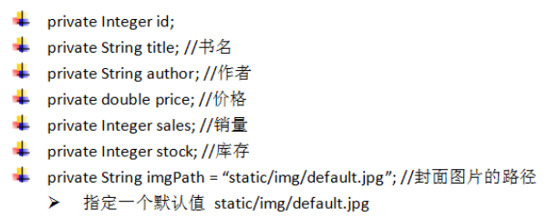

# day08_课后练习

## 第一题：概念辨析

1. 一个类与它的对象之间是什么关系？
2. 如何定义一个类，由哪些部分组成，各个部分的作用是什么？
3. 如何创建一个对象，如何使用该对象？
4. 局部变量和成员变量的区别？
5. 构造方法和成员方法的区别？

## 第二题：语法练习

* 语法与技能：
  * 包、类（属性、构造器、方法）、对象、this
  * eclipse使用
* 在com.atguigu.test02.bean包中定义一个圆形Circle类。
  * 属性：私有化
    * r：半径
  * 构造方法：
    * 无参构造方法
    * 满参构造方法
  * 成员方法：
    * get/set方法
    * showArea方法：打印圆形面积
    * showPerimeter方法：打印圆形周长
* 在com.atguigu.test02.test包中定义测试类TestCircle：创建Circle对象，并测试。

* 开发提示： 

  > 面向周长公式：2 * 3.14*  半径
  >
  > 圆形面积公式：3.14* 半径^2

```java
package com.atguigu.test02.bean;

public class Circle {
	private double radius;

	public Circle(double radius) {
		this.radius = radius;
	}

	public Circle() {
	}

	public double getRadius() {
		return radius;
	}

	public void setRadius(double radius) {
		this.radius = radius;
	}
	
	public void showArea(){
		System.out.println("半径为：" + radius + "，面积：" + 3.14 * radius * radius);
	}
	
	public void showPerimeter(){
		System.out.println("半径为：" + radius + "，周长：" + 2 * 3.14 * radius);
	}
}

```

```java
package com.atguigu.test02.test;

import com.atguigu.test02.bean.Circle;

public class Test02 {
	public static void main(String[] args) {
		Circle c1 = new Circle(1.2);
		c1.showArea();
		c1.showPerimeter();
	}
}

```


## 第三题：语法练习

* 语法与技能：
  * 包、类（属性、构造器、方法）、对象、this
  * eclipse使用
* 在com.atguigu.test03.bean包中定义一个日期MyDate类。
  * 属性：
    * year：年
    * month：月
    * day：日
  * 构造方法：
    * 满参构造方法
  * 成员方法：
    * get/set方法
    * void showDate方法：打印日期。
    * boolean isLeapYear()方法：判断当前日期是否是闰年
* 在com.atguigu.test03.test包中定义测试类：创建MyDate对象，并测试。

* 代码实现，效果如图所示：

  

* 开发提示： 

  * 闰年：
    * 普通年（不能被100整除的年份）能被4整除的为闰年。（如2004年就是闰年,1999年不是闰年）；
    * 世纪年（能被100整除的年份）能被400整除的是闰年。(如2000年是闰年，1900年不是闰年)；

```java
package com.atguigu.test03.bean;

public class MyDate {
	private int year;
	private int month;
	private int day;

	public MyDate() {
	}

	public MyDate(int year, int month, int day) {
		this.year = year;
		this.month = month;
		this.day = day;
	}

	public int getYear() {
		return year;
	}

	public void setYear(int year) {
		this.year = year;
	}

	public int getMonth() {
		return month;
	}

	public void setMonth(int month) {
		this.month = month;
	}

	public int getDay() {
		return day;
	}

	public void setDay(int day) {
		this.day = day;
	}

	public void showDate() {
		System.out.println("日期" + year + "年" + month + "月" + day + "日");
	}

	public boolean isLeapYear() {
		return year % 4 == 0 && year % 100 != 0 || year % 400 == 0;
	}
}

```

```java
package com.atguigu.test03.test;

import com.atguigu.test03.bean.MyDate;

public class Test03 {
	public static void main(String[] args) {
		MyDate my = new MyDate(2019,5,13);
		my.showDate();
		boolean flag = my.isLeapYear();
		System.out.println(my.getYear()+ (flag?"是闰年":"不是闰年"));
	}
}

```


## 第四题：语法练习

* 语法与技能：
  * 包、类（属性、构造器、方法）、对象、this
  * eclipse使用
* 在com.atguigu.test04.bean包中定义一个扑克Card类。
  * 属性：
    * 花色
    * 点数
  * 构造方法：
    * 满参构造方法
  * 成员方法：
    * showCard方法：打印牌面信息
* 在com.atguigu.test04.test包中定义测试类，创建Card对象，调用showCard方法。

* 代码实现，效果如图所示：

  

```java
package com.atguigu.test04.bean;

public class Card {
	private String hua;
	private String dian;

	public Card(String hua, String dian) {
		this.hua = hua;
		this.dian = dian;
	}

	public Card() {
	}

	public String getHua() {
		return hua;
	}

	public void setHua(String hua) {
		this.hua = hua;
	}

	public String getDian() {
		return dian;
	}

	public void setDian(String dian) {
		this.dian = dian;
	}

	public void showCard() {
		System.out.println(hua + dian);
	}
}

```

```java
package com.atguigu.test04.test;

import com.atguigu.test03.bean.Card;

public class Test03 {
	public static void main(String[] args) {
		Card c = new Card("黑桃", "A");
		c.showCard();
	}
}

```


## 第五题：语法练习

* 语法与技能：
  * 包、类（属性、构造器、方法）、对象、this
  * eclipse使用

* 在com.atguigu.test05.bean包中创建一个Book类，属性私有化，提供有参和无参构造，get/set

  

* 在com.atguigu.test05.test包中，创建TestBook类，并创建Book数组，创建多个Book对象，存储到数组中，并遍历显示他们的信息，并按照销量从高到低排序


```java
package com.atguigu.test05.bean;

public class Book {
	private Integer id;
	private String title;
	private String author;
	private double price;
	private Integer sales;
	private Integer stock;
	private String imgPath = "static/img/default.jpg";
	public Book() {
	}
	public Book(Integer id, String title, String author, double price, Integer sales, Integer stock) {
		this.id = id;
		this.title = title;
		this.author = author;
		this.price = price;
		this.sales = sales;
		this.stock = stock;
	}
	public Book(Integer id, String title, String author, double price, Integer sales, Integer stock, String imgPath) {
		this.id = id;
		this.title = title;
		this.author = author;
		this.price = price;
		this.sales = sales;
		this.stock = stock;
		this.imgPath = imgPath;
	}
	public Integer getId() {
		return id;
	}
	public void setId(Integer id) {
		this.id = id;
	}
	public String getTitle() {
		return title;
	}
	public void setTitle(String title) {
		this.title = title;
	}
	public String getAuthor() {
		return author;
	}
	public void setAuthor(String author) {
		this.author = author;
	}
	public double getPrice() {
		return price;
	}
	public void setPrice(double price) {
		this.price = price;
	}
	public Integer getSales() {
		return sales;
	}
	public void setSales(Integer sales) {
		this.sales = sales;
	}
	public Integer getStock() {
		return stock;
	}
	public void setStock(Integer stock) {
		this.stock = stock;
	}
	public String getImgPath() {
		return imgPath;
	}
	public void setImgPath(String imgPath) {
		this.imgPath = imgPath;
	}
	public String getInfo(){
		return id + "\t" + title + "\t" + author + "\t" + price + "\t" + sales + "\t" + stock + "\t" + imgPath;
	}
}

```

```java
package com.atguigu.test05.test;

import com.atguigu.test05.bean.Book;

public class Test05 {
	public static void main(String[] args) {
		Book[] all = new Book[5];
		
		all[0] = new Book(1, "《从入门到精通》", "张三", 88, 100, 1000,"static/img/1.jpg");
		all[1] = new Book(2, "《从入门到放弃》", "李四", 89, 200, 800);
		all[2] = new Book(3, "《从入门到脱发》", "王五", 56, 10, 500);
		all[3] = new Book(4, "《从入门到吃药》", "赵六", 100, 180, 900);
		all[4] = new Book(5, "《从入门到升仙》", "钱七", 99, 0, 1000);

		System.out.println("排序前：");
		System.out.println("编号\t书名\t\t作者\t价格\t销量\t库存\t图片");
		for (int i = 0; i < all.length; i++) {
			System.out.println(all[i].getInfo());
		}
		
		//排序
		for (int i = 1; i < all.length; i++) {
			for (int j = 0; j < all.length-i; j++) {
				if(all[j].getSales() < all[j+1].getSales()){
					Book temp = all[j];
					all[j] = all[j+1];
					all[j+1] = temp;
				}
			}
		}
		System.out.println("排序后：");
		System.out.println("编号\t书名\t\t作者\t价格\t销量\t库存\t图片");
		for (int i = 0; i < all.length; i++) {
			System.out.println(all[i].getInfo());
		}
	}
}

```


## 第六题：语法练习

案例：

​	1、声明矩形类com.atguigu.bean.Rectangle

​	（1）包含属性：长和宽，要求属性私有化

​	（2）给每一个属性提供get/set方法

​	（3）public double getArea()

​	（4）public double getPerimeter()

​	（5）提供getInfo()返回矩形对象的信息

​			例如：长：4，宽：2，面积：8，周长：12

​	2、测试类com.atguigu.test.Test06，

​	（1）在main()方法中创建Rectangle对象，并用set方法为属性赋值

​	（2）调用get方法打印属性的值，调用getArea打印面积，调用getPerimeter打印周长

​	（3）再次调用set方法修改属性的值为原来属性值的两倍

​	（4）调用getInfo方法打印矩形信息

```java
package com.atguigu.bean;

public class Rectangle {
	private double length;
	private double width;
	
	public void setLength(double chang){
		length = chang;
	}
	public double getLength(){
		return length;
	}
	public void setWidth(double kuan){
		width = kuan;
	}
	public double getWidth(){
		return width;
	}
	
	public double getArea(){
		return length * width;
	}
	public double getPerimeter(){
		return 2 * (length + width);
	}
	public String getInfo(){
		return "长：" + length + "，宽：" + width + "，面积：" + getArea() + "，周长：" + getPerimeter(); 
	}
}

```

```java
package com.atguigu.test;

import com.atguigu.bean.Rectangle;

public class Test06 {

	public static void main(String[] args) {
		Rectangle r = new Rectangle();
		r.setLength(2);
		r.setWidth(1);
		System.out.println("长：" + r.getLength());
		System.out.println("宽：" + r.getWidth());
		System.out.println("面积：" + r.getArea());
		System.out.println("周长：" + r.getPerimeter());
		
		r.setLength(r.getLength()*2);
		r.setWidth(r.getWidth()*2);
		System.out.println(r.getInfo());
	}

}
```


## 第七题：语法练习

案例：

​	编写Test07类，在main方法中，

​	（1）创建一个Rectangle[]数组，长度为5

​	（2）并创建5个Rectangle的矩形对象，放到数组中，矩形的长和宽随机生成[1,10.0)范围内的值

​	（3）遍历显示

​	（4）按照面积从小到大排序

​	（5）再次遍历显示

```java
public class Test07 {
	public static void main(String[] args){
		Rectangle[] arr  = new Rectangle[5];
		for(int i=0; i<arr.length; i++){
			arr[i] = new Rectangle();
			double d1 = Math.random()*9+1;
			double d2 = Math.random()*9+1;
			arr[i].setLength(d1>d2?d1:d2);	
			arr[i].setWidth(d1<=d2?d1:d2);
		}
		
		for(int i=0; i<arr.length; i++){
			System.out.println(arr[i].getInfo());
		}
		System.out.println("------------------------");
		for(int i=1; i<arr.length; i++){
			for(int j=0; j<arr.length-i; j++){
				if(arr[j].getArea() > arr[j+1].getArea()){
					Rectangle temp = arr[j];
					 arr[j] = arr[j+1];
					 arr[j+1] = temp;
				}
			}
		}
		for(int i=0; i<arr.length; i++){
			System.out.println(arr[i].getInfo());
		}
	}
}

```

