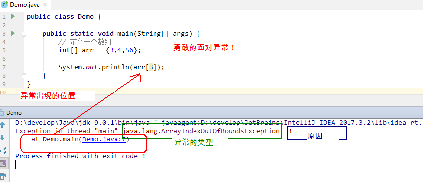
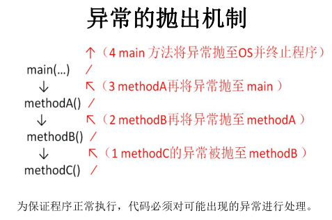

# JavaSE_【异常】
## 主要内容

- 异常的体系结构
- **常见异常**
- throw关键字（手动创建并抛出异常）
- **异常处理机制一：try**（掌握）
- **异常处理机制二：throws**（掌握）
- 自定义异常

## 学习目标

- [ ] 能够辨别程序中异常和错误的区别
- [ ] 说出异常的分类
- [ ] 说出虚拟机处理异常的方式
- [ ] 可以编写代码演示OOM
- [ ] 列出常见的5个运行时异常
- [ ] 列出常见的5个编译时异常
- [ ] 能够使用try...catch关键字处理异常
- [ ] 能够使用throws关键字处理异常
- [ ] 能够自定义异常类
- [ ] 能够处理自定义异常类

# 第八章    异常

## 8.1 异常概述

### ***引入异常***

***生活中的异常：***

 

正常情况下，小王每日开车去上班，耗时大约30分钟

 

但是，异常情况迟早要发生！

 

面对异常该怎么办呢？生活中，我们会根据不同的异常进行相应的处理，而不会就此中断我们的生活

 

在使用计算机语言进行项目开发的过程中，即使程序员把代码写得 尽善尽美，在系统的运行过程中仍然会遇到一些问题，因为很多问题不是靠代码能够避免的，比如：客户输入数据的格式，读取文件是否存在，网络是否始终保持通畅等等。

* **异常** ：指的是程序在执行过程中，出现的非正常的情况，如果不处理最终会导致JVM的非正常停止。

> 异常指的并不是语法错误,语法错了,编译不通过,不会产生字节码文件,根本不能运行.
>
> 异常也不是指逻辑代码错误而没有得到想要的结果，例如：求a与b的和，你写成了a-b 除数为0的情况

对于异常，一般有两种解决方法：一是遇到错误就终止程序的运行。另一种方法是由程序员在编写程序时，就考虑到错误的检测、错误消息的提示，以及错误的处理。

Java中是如何表示不同的异常情况，又是如何让程序员得知，并处理异常的呢？

Java中把不同的异常用不同的类表示，一旦发生某种异常，就通过创建该异常类型的对象，并且抛出，然后程序员可以catch到这个异常对象，并处理，如果无法catch到这个异常对象，那么这个异常对象将会导致程序终止。

## 8.2 异常体系

异常的根类是`java.lang.Throwable`，其下有两个子类：`java.lang.Error`与`java.lang.Exception`，平常所说的异常指`java.lang.Exception`。


**Throwable体系：**

* **Error**:严重错误Error，无法通过处理的错误，只能事先避免，好比绝症。
  * 例如：StackOverflowError，OOM（OutOfMemoryError）  内存泄漏（Memory Leak）  。
  *  内存溢出(Out Of Memory，简称OOM)是指应用系统中存在无法回收的[内存](https://baike.baidu.com/item/内存/103614)或使用的[内存](https://baike.baidu.com/item/内存/103614)过多，最终使得程序运行要用到的[内存](https://baike.baidu.com/item/内存/103614)大于能提供的最大内存。 
  *  内存泄漏（Memory Leak）是指程序中己动态分配的堆内存由于某种原因程序未释放或无法释放，造成系统内存的浪费，导致程序运行速度减慢甚至系统崩溃等严重后果 。
* **Exception**:表示异常，其它因编程错误或偶然的外在因素导致的一般性问题，程序员可以通过代码的方式纠正，使程序继续运行，是必须要处理的。好比感冒、阑尾炎。
  * 例如：空指针访问、试图读取不存在的文件、网络连接中断、数组角标越界

**Throwable中的常用方法：**

* `public void printStackTrace()`:打印异常的详细信息。

  *包含了异常的类型,异常的原因,还包括异常出现的位置,在开发和调试阶段,都得使用printStackTrace。*

* `public String getMessage()`:获取发生异常的原因。

  *提示给用户的时候,就提示错误原因。*


***出现异常,不要紧张,把异常的简单类名,拷贝到API中去查。***



## 8.3 异常分类

我们平常说的异常就是指Exception，因为这类异常一旦出现，我们就要对代码进行更正，修复程序。

**异常(Exception)的分类**:根据在编译时期还是运行时期去检查异常?

* **编译时期异常**:checked异常。在编译时期,就会检查,如果没有处理异常,则编译失败。(如文件找不到异常)
* **运行时期异常**:runtime异常。在运行时期,检查异常.在编译时期,运行异常不会被编译器检测到(不报错)。(如数组索引越界异常，类型转换异常)。程序员应该积极避免其出现的异常，而不是使用try..catch处理，因为这类异常很普遍，若都使用try..catch或throws处理可能会对程序的可读性和运行效率产生影响。


### 演示常见的错误和异常

#### 1、VirtualMachineError

最常见的就是：StackOverflowError、OutOfMemoryError

```java
	@Test
	public void test01(){
		//StackOverflowError
		digui();
	}
	
	public void digui(){
		digui();
	}
```

```java
	@Test
	public void test02(){
		//OutOfMemoryError
		//方式一：
		int[] arr = new int[Integer.MAX_VALUE];
	}
	@Test
	public void test03(){
		//OutOfMemoryError
		//方式二：
		StringBuilder s = new StringBuilder();
		while(true){
			s.append("atguigu");
		}
	}
```

#### 2、运行时异常

```java
	@Test
	public void test01(){
	    //NullPointerException
		int[][] arr = new int[3][];
		System.out.println(arr[0].length);
	}
	
	@Test
	public void test02(){
		//ClassCastException
		Person p = new Man();
		Woman w = (Woman) p;
	}
	
	@Test
	public void test03(){
		//ArrayIndexOutOfBoundsException
		int[] arr = new int[5];
		for (int i = 1; i <= 5; i++) {
			System.out.println(arr[i]);
		}
	}
	
	@Test
	public void test04(){
		//InputMismatchException
		Scanner input = new Scanner(System.in);
		System.out.print("请输入一个整数：");
		int num = input.nextInt();
	}
	
	@Test
	public void test05(){
		int a = 1;
		int b = 0;
		//ArithmeticException
		System.out.println(a/b);
	}
```

#### 3、编译时异常

```java
	@Test
	public void test06() throws InterruptedException{
		Thread.sleep(1000);//休眠1秒
	}
	
	@Test
	public void test07() throws FileNotFoundException{
		FileInputStream fis = new FileInputStream("Java学习秘籍.txt");
	}
	
	@Test
	public void test08() throws SQLException{
		Connection conn = DriverManager.getConnection("....");
	}
```

## 8.4 异常的抛出机制

先运行下面的程序，程序会产生一个数组索引越界异常ArrayIndexOfBoundsException。我们通过图解来解析下异常产生的过程。

 工具类

~~~java
public class ArrayTools {
    // 对给定的数组通过给定的角标获取元素。
    public static int getElement(int[] arr, int index) {
        int element = arr[index];
        return element;
    }
}
~~~

 测试类

~~~java
public class ExceptionDemo {
    public static void main(String[] args) {
        int[] arr = { 34, 12, 67 };
        intnum = ArrayTools.getElement(arr, 4)
        System.out.println("num=" + num);
        System.out.println("over");
    }
}
~~~

上述程序执行过程图解：




## 8.5 异常的处理

Java异常处理的五个关键字：**try、catch、finally、throw、throws**

### 8.5.1 异常throw

Java程序的执行过程中如出现异常，会生成一个异常类对象，该异常对象将被提交给Java运行时系统，这个过程称为抛出(throw)异常。异常对象的生成有两种方式：

* 由虚拟机自动生成：程序运行过程中，虚拟机检测到程序发生了问题，如果在当前代码中没有找到相应的处理程序，就会在后台自动创建一个对应异常类的实例对象并抛出——自动抛出
* 由开发人员手动创建：Exception exception = new ClassCastException();——创建好的异常对象不抛出对程序没有任何影响，和创建一个普通对象一样，但是一旦throw抛出，就会对程序运行产生影响了。

下面我们说明手动抛出异常：

比如，在定义方法时，方法需要接受参数。那么，当调用方法使用接受到的参数时，首先需要先对参数数据进行合法的判断，数据若不合法，就应该告诉调用者，这时可以使用抛出异常的方式来告诉调用者。

在java中，提供了一个**throw**关键字，它用来抛出一个指定的异常对象。那么，抛出一个异常具体如何操作呢？

1. 创建一个异常对象。封装一些提示信息(信息可以自己编写)。

2. 需要将这个异常对象告知给调用者。怎么告知呢？怎么将这个异常对象传递到调用者处呢？通过关键字throw就可以完成。throw 异常对象。

   throw**用在方法内**，用来抛出一个异常对象，将这个异常对象传递到调用者处，并**结束**当前方法的执行。

**使用格式：**

~~~
throw new 异常类名(参数);
~~~

 例如：

~~~java
throw new NullPointerException("要访问的arr数组不存在");

throw new ArrayIndexOutOfBoundsException("该索引在数组中不存在，已超出范围");
~~~

学习完抛出异常的格式后，我们通过下面程序演示下throw的使用。

~~~java
public class ThrowDemo {
    public static void main(String[] args) {
        //创建一个数组 
        int[] arr = {2,4,52,2};
        //根据索引找对应的元素 
        int index = 4;
        int element = getElement(arr, index);

        System.out.println(element);
        System.out.println("over");
    }
    /*
     * 根据 索引找到数组中对应的元素
     */
    public static int getElement(int[] arr,int index){ 
        if(arr == null){
            /*
             判断条件如果满足，当执行完throw抛出异常对象后，方法已经无法继续运算。
             这时就会结束当前方法的执行，并将异常告知给调用者。这时就需要通过异常来解决。 
              */
            throw new NullPointerException("要访问的arr数组不存在");
        }
       	//判断  索引是否越界
        if(index<0 || index>arr.length-1){
             /*
             判断条件如果满足，当执行完throw抛出异常对象后，方法已经无法继续运算。
             这时就会结束当前方法的执行，并将异常告知给调用者。这时就需要通过异常来解决。 
              */
             throw new ArrayIndexOutOfBoundsException("哥们，角标越界了~~~");
        }
        int element = arr[index];
        return element;
    }
}
~~~

> 注意：如果产生了问题，我们就会throw将问题描述类即异常进行抛出，也就是将问题返回给该方法的调用者。
>
> 那么对于调用者来说，该怎么处理呢？一种是进行捕获处理，另一种就是继续讲问题声明出去，使用throws声明处理。

#### 练习1

1、声明Husband类，包含姓名和妻子属性，属性私有化，提供一个Husband(String name)的构造器，重写toString方法，返回丈夫姓名和妻子的姓名

2、声明Wife类，包含姓名和丈夫属性，属性私有化，提供一个Wife(String name)的构造器，重写toString方法，返回妻子的姓名和丈夫的姓名

3、声明TestMarry类，在main中，创建Husband和Wife对象后直接打印妻子和丈夫对象，查看异常情况，看如何解决


#### 练习2

1、声明银行账户类Account

（1）包含账号、余额属性，要求属性私有化，提供无参和有参构造，

（2）包含取款方法，当取款金额为负数时，抛出IllegalArgumentException，异常信息为“取款金额有误，不能为负数”，当取款金额超过余额时，抛出UnsupportedOperationException，异常信息为“取款金额不足，不支持当前取款操作”

（3）包含存款方法，当取款金额为负数时，抛出IllegalArgumentException，异常信息为“存款金额有误，不能为负数”

2、编写测试类，创建账号对象，并调用取款和存款方法，并传入非法参数，测试发生对应的异常。


### 8.5.2 声明异常throws

**声明异常**：将问题标识出来，报告给调用者。如果方法内通过throw抛出了**编译时异常**，而没有捕获处理（稍后讲解该方式），那么必须通过throws进行声明，让调用者去处理。

关键字**throws**运用于方法声明之上,用于表示当前方法不处理异常,而是提醒该方法的调用者来处理异常(抛出异常).

**声明异常格式：**

~~~
修饰符 返回值类型 方法名(参数) throws 异常类名1,异常类名2…{   }	
~~~

声明异常的代码演示：

~~~java
import java.io.File;
import java.io.FileNotFoundException;

public class TestException {
	public static void main(String[] args) throws FileNotFoundException {
		readFile("不敲代码学会Java秘籍.txt");
	}
	
	// 如果定义功能时有问题发生需要报告给调用者。可以通过在方法上使用throws关键字进行声明
	public static void readFile(String filePath) throws FileNotFoundException{
		File file = new File(filePath);
		if(!file.exists()){
			throw new FileNotFoundException(filePath+"文件不存在");
		}
	}
	
}
~~~

throws用于进行异常类的声明，若该方法可能有多种异常情况产生，那么在throws后面可以写多个异常类，用逗号隔开。

~~~java
import java.io.File;
import java.io.FileNotFoundException;

public class TestException {
	public static void main(String[] args) throws FileNotFoundException,IllegalAccessException {
		readFile("不敲代码学会Java秘籍.txt");
	}
	
	// 如果定义功能时有问题发生需要报告给调用者。可以通过在方法上使用throws关键字进行声明
	public static void readFile(String filePath) throws FileNotFoundException,IllegalAccessException{
		File file = new File(filePath);
		if(!file.exists()){
			throw new FileNotFoundException(filePath+"文件不存在");
		}
		if(!file.isFile()){
			throw new IllegalAccessException(filePath + "不是文件，无法直接读取");
		}
		//...
	}
	
}
~~~

#### 练习

1、声明银行账户类Account

（1）包含账号、余额属性，要求属性私有化，提供无参和有参构造，

（2）包含取款方法，当取款金额为负数时，抛出Exception，异常信息为“越取你余额越多，想得美”，当取款金额超过余额时，抛出Exception，异常信息为“取款金额不足，不支持当前取款操作”

（3）包含存款方法，当取款金额为负数时，抛出Exception，异常信息为“越存余额越少，你愿意吗？”

2、编写测试类，创建账号对象，并调用取款和存款方法，并传入非法参数，测试发生对应的异常。


### 8.5.3 捕获异常try…catch

如果异常出现的话,会立刻终止程序,所以我们得处理异常:

1. 该方法不处理,而是声明抛出,由该方法的调用者来处理(throws)。
2. 在方法中使用try-catch的语句块来处理异常。

**try-catch**的方式就是捕获异常。

* **捕获异常**：Java中对异常有针对性的语句进行捕获，可以对出现的异常进行指定方式的处理。

捕获异常语法如下：

~~~java
try{
     编写可能会出现异常的代码
}catch(异常类型1  e){
     处理异常的代码
     //记录日志/打印异常信息/继续抛出异常
}catch(异常类型2  e){
     处理异常的代码
     //记录日志/打印异常信息/继续抛出异常
}
....
~~~

**try：**该代码块中编写可能产生异常的代码。

**catch：**用来进行某种异常的捕获，实现对捕获到的异常进行处理。

* 可以有多个catch块，按顺序匹配。
* 如果多个异常类型有包含关系，那么小上大下

演示如下：

~~~java
public class TestException {
	public static void main(String[] args)  {
		try {
			readFile("不敲代码学会Java秘籍.txt");
		} catch (FileNotFoundException e) {
//			e.printStackTrace();
//			System.out.println("好好敲代码，不要老是想获得什么秘籍");
			System.out.println(e.getMessage());
		} catch (IllegalAccessException e) {
			e.printStackTrace();
		} 
		
		System.out.println("继续学习吧...");
	}
	
	// 如果定义功能时有问题发生需要报告给调用者。可以通过在方法上使用throws关键字进行声明
	public static void readFile(String filePath) throws FileNotFoundException, IllegalAccessException{
		File file = new File(filePath);
		if(!file.exists()){
			throw new FileNotFoundException(filePath+"文件不存在");
		}
		if(!file.isFile()){
			throw new IllegalAccessException(filePath + "不是文件，无法直接读取");
		}
		//...
	}
	
}
~~~

如何获取异常信息：

Throwable类中定义了一些查看方法:

* `public String getMessage()`:获取异常的描述信息,原因(提示给用户的时候,就提示错误原因。


* `public void printStackTrace()`:打印异常的跟踪栈信息并输出到控制台。

​            *包含了异常的类型,异常的原因,还包括异常出现的位置,在开发和调试阶段,都得使用printStackTrace。*

### 8.5.4 finally块

**finally**：有一些特定的代码无论异常是否发生，都需要执行。另外，因为异常会引发程序跳转，导致有些语句执行不到。而finally就是解决这个问题的，在finally代码块中存放的代码都是一定会被执行的。

什么时候的代码必须最终执行？

当我们在try语句块中打开了一些物理资源(磁盘文件/网络连接/数据库连接等),我们都得在使用完之后,最终关闭打开的资源。

finally的语法:

```java
 try{
     
 }catch(...){
     
 }finally{
     无论try中是否发生异常，也无论catch是否捕获异常，也不管try和catch中是否有return语句，都一定会执行
 }
 
 或
  try{
     
 }finally{
     无论try中是否发生异常，也不管try中是否有return语句，都一定会执行
 } 
```

> 注意:finally不能单独使用。

比如在我们之后学习的IO流中，当打开了一个关联文件的资源，最后程序不管结果如何，都需要把这个资源关闭掉。

finally代码参考如下：

```java
import java.io.File;
import java.io.FileInputStream;
import java.io.FileNotFoundException;
import java.io.IOException;

public class TestException {
	public static void main(String[] args)  {
		readFile("不敲代码学会Java秘籍.txt");
		System.out.println("继续学习吧...");
	}
	
	// 如果定义功能时有问题发生需要报告给调用者。可以通过在方法上使用throws关键字进行声明
	public static void readFile(String filePath) {
		File file = new File(filePath);
		FileInputStream fis = null;
		try {
			
			if(!file.exists()){
				throw new FileNotFoundException(filePath+"文件不存在");
			}
			if(!file.isFile()){
				throw new IllegalAccessException(filePath + "不是文件，无法直接读取");
			}
			fis = new FileInputStream(file);
			//...
		} catch (Exception e) {
			//抓取到的是编译期异常  抛出去的是运行期 
			throw new RuntimeException(e);
		}finally{
			System.out.println("无论如何，这里的代码一定会被执行");
			try {
				if(fis!=null){
					fis.close();
				}
			} catch (IOException e) {
				//抓取到的是编译期异常  抛出去的是运行期 
				throw new RuntimeException(e);
			}
		}
		
	}
}
```

> 当只有在try或者catch中调用退出JVM的相关方法，例如System.exit(0),此时finally才不会执行,否则finally永远会执行。


### 8.5.5 finally与return 

#### 形式一：从try回来

```java
public class TestReturn {
	public static void main(String[] args) {
		int result = test("12");
		System.out.println(result);
	}

	public static int test(String str){
		try{
			Integer.parseInt(str);
			return 1;
		}catch(NumberFormatException e){
			return -1;
		}finally{
			System.out.println("test结束");
		}
	}
}
```


#### 形式二：从catch回来

```java
public class TestReturn {
	public static void main(String[] args) {
		int result = test("a");
		System.out.println(result);
	}

	public static int test(String str){
		try{
			Integer.parseInt(str);
			return 1;
		}catch(NumberFormatException e){
			return -1;
		}finally{
			System.out.println("test结束");
		}
	}
}
```


#### 形式三：从finally回来

```java
public class TestReturn {
	public static void main(String[] args) {
		int result = test("a");
		System.out.println(result);
	}

	public static int test(String str){
		try{
			Integer.parseInt(str);
			return 1;
		}catch(NumberFormatException e){
			return -1;
		}finally{
            System.out.println("test结束");
			return 0;
		}
	}
}
```


## 8.6 异常注意事项

* 多个异常使用捕获又该如何处理呢？

  1. 多个异常分别处理。
  2. 多个异常一次捕获，多次处理。(推荐)
  3. 多个异常一次捕获一次处理。

  一般我们是使用一次捕获多次处理方式，格式如下：

  ```java
  try{
       编写可能会出现异常的代码
  }catch(异常类型A  e){  当try中出现A类型异常,就用该catch来捕获.
       处理异常的代码
       //记录日志/打印异常信息/继续抛出异常
  }catch(异常类型B  e){  当try中出现B类型异常,就用该catch来捕获.
       处理异常的代码
       //记录日志/打印异常信息/继续抛出异常
  }
  ```

  > 注意:这种异常处理方式，要求多个catch中的异常不能相同，并且若catch中的多个异常之间有子父类异常的关系，那么子类异常要求在上面的catch处理，父类异常在下面的catch处理。

* 运行时异常被抛出可以不处理。即不捕获也不声明抛出。

* 如果finally有return语句,永远返回finally中的结果,避免该情况. 

* 如果父类抛出了多个异常,子类重写父类方法时,抛出和父类相同的异常或者是父类异常的子类或者不抛出异常。

* 父类方法没有抛出异常，子类重写父类该方法时也不可抛出异常。此时子类方法中产生了编译时异常，只能捕获处理，不能声明抛出

## 8.7 自定义异常

**为什么需要自定义异常类:**

我们说了Java中不同的异常类,分别表示着某一种具体的异常情况,那么在开发中总是有些异常情况是Java开发人员没有定义好的,此时我们根据自己业务的异常情况来定义异常类。例如年龄负数问题，考试成绩负数问题等等。那么能不能自己定义异常呢？可以

**异常类如何定义:**

1. 自定义一个编译期异常: 自定义类 并继承于`java.lang.Exception`。
2. 自定义一个运行时期的异常类:自定义类 并继承于`java.lang.RuntimeException`。

**演示自定义异常：**

要求：我们模拟注册操作，如果用户名已存在，则抛出异常并提示：亲，该用户名已经被注册。

首先定义一个登陆异常类RegisterException：

~~~java
// 业务逻辑异常
public class RegisterException extends Exception {
    /**
     * 空参构造
     */
    public RegisterException() {
    }

    /**
     *
     * @param message 表示异常提示
     */
    public RegisterException(String message) {
        super(message);
    }
}
~~~

模拟登陆操作，使用数组模拟数据库中存储的数据，并提供当前注册账号是否存在方法用于判断。

~~~java
public class Demo {
    // 模拟数据库中已存在账号
    private static String[] names = {"bill","hill","jill"};
   
    public static void main(String[] args) {     
        //调用方法
        try{
              // 可能出现异常的代码
            checkUsername("nill");
            System.out.println("注册成功");//如果没有异常就是注册成功
        }catch(RegisterException e){
            //处理异常
            e.printStackTrace();
        }
    }

    //判断当前注册账号是否存在
    //因为是编译期异常，又想调用者去处理 所以声明该异常
    public static boolean checkUsername(String uname) throws LoginException{
        for (int i=0; i<names.length; i++) {
            if(names[i].equals(uname)){//如果名字在这里面 就抛出登陆异常
                throw new RegisterException("亲"+name+"已经被注册了！");
            }
        }
        return true;
    }
}
~~~

结论：

* 从Exception类或者它的子类派生一个子类即可
* 习惯上，自定义异常类应该包含2个构造器：一个是无参构造，另一个是带有详细信息的构造器
* 自定义的异常只能通过throw抛出。
* 自定义异常最重要的是异常类的名字，当异常出现时，可以根据名字判断异常类型。

