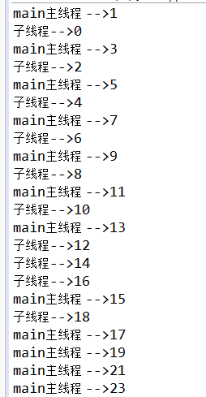
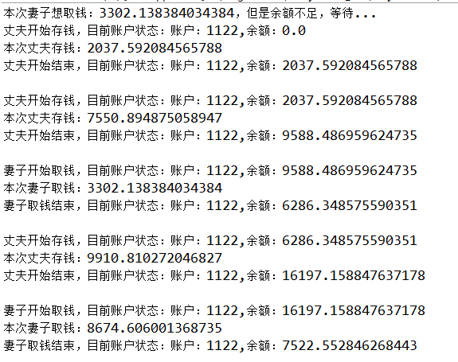

# day15_课后练习

## 第1题

案例：在子线程中输出1-100之间的偶数，主线程输出1-100之间的奇数。

效果如下：

## 第2题

案例：创建和启动2个子线程，一个打印1-10之间奇数，一个打印1-10之间偶数，

（1）要求每个线程要么不打印，要么就连续打印5个数，每个数打印间隔500毫秒

（2）但两个线程不要求交替打印。

效果如下：

## 第3题

案例：创建和启动2个子线程，一个打印奇数，一个打印偶数，

（1）要求实现交替打印。

（2）每个数打印间隔1秒

效果如下：

## 第4题

案例：

​	1、创建一个银行账户类，

​	（1）属性：账号，余额，

​	（2）get/set，

​	（3）toString()：返回：账户：xxx，余额：xxx

​	2、创建一个丈夫类

​		负责往里存钱，每次存款[0,10000)以内不等

​	3、创建一个妻子类

​		负责取钱，每次取款[0,10000)以内不等，如果余额不足，要等丈夫存够了才能取

## 第5题

案例：请按要求编写多线程应用程序，模拟多个人通过一个山洞：

​	1、这个山洞每次只能通过一个人，每个人通过山洞的时间为5秒；

​	2、随机生成10个人，同时准备过此山洞

​	3、定义一个变量用于记录通过隧道的人数

​	4、显示每次通过山洞人的姓名，和通过顺序；

**操作步骤描述**

​	1.定义一个隧道类，实现Runnable接口：

​		1.1 定义一个变量，用来记录通过隧道的人数；

​		1.2 重写Runnable的run方法；

​		1.3 定义一个同步方法，模拟每个人通过隧道需要5秒钟：

​			1.3.1 打印“xx开始通过隧道...”

​			1.3.2 子线程睡眠5秒钟，模拟每个人通过隧道需要5秒钟；

​			1.3.3 改变通过的人次；

​			1.3.4 打印线程名称及其通过隧道的顺序，模拟人通过隧道及其顺序；

​		1.4 调用通过隧道的方法；

​	2.定义一个测试类：

​		2.1 在main方法中创建一个隧道类对象；

​		2.2 在main方法中，循环创建10个子线程对象，通过构造方法把隧道对象

​		    和线程名（作为人的姓名）传递进去，并开启子线程；

