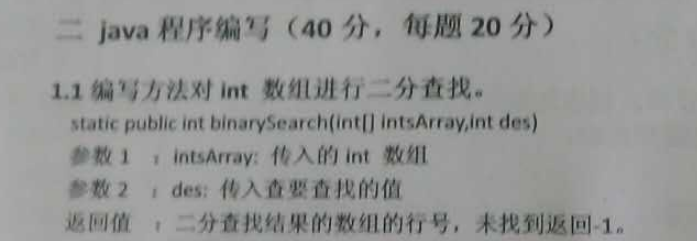
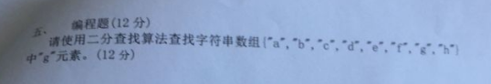
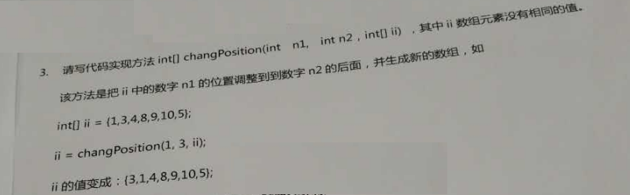

# day16_课后练习

## 1、编程题


有一个数组a[1000]存放0-999，要求每隔二个数删掉一个数，到末尾时循环至开头，继续运行。求最后一个被删掉的数的原始下标位置。

以8个数为例：

{0,1,2,3,4,5,6,7}：0->1->2（删掉）->3->4->5（删掉）->6->7->0（删掉）。。。

```java
/*
 * 有一个数组a[1000]存放0-999，要求每隔二个数删掉一个数，到末尾时循环至开头，继续运行。求最后一个被删掉的数的原始下标位置。

以8个数为例：

{0,1,2,3,4,5,6,7}：0->1->2（删掉）->3->4->5（删掉）->6->7->0（删掉）。。。
 */
public class TestHomework1 {
	public static void main(String[] args) throws InterruptedException {
		int[] a = new int[1000];
		for (int i = 0; i < a.length; i++) {
			a[i] = i;
		}
		
		int i=0;
		int count = 0;
		int delNum = 0;//被删掉的数字个数
		while(true) {
			if(a[i]!=-1) {//被删掉的数不再计入count个数
				count++;
			}
			if(count==3) {//隔两个，第三个删掉
				a[i]=-1;//a[i]=-1，表示被删掉的数
				count=0;//count重新计数
				delNum++;//统计已经被删掉几个了
			}
			if(delNum==a.length-1) {//留下最后一个结束删除过程
				break;
			}
			if(++i==a.length) {//如果下标右移已经到头了，要从头开始
				i=0;
			}
		}
		
		for (int j = 0; j < a.length; j++) {
			if(a[j]!=-1) {
				System.out.println("最后一个被删掉的数是：a[j]=" + a[j] + "，它的下标：" + j);
			}
		}
	}
}
```


## 2、编程题



```java
	public static int binarySearch(int[] intsArray, int des) {
		int left = 0;
		int right = intsArray.length-1;
		int mid = (left + right)/2;
		while(left<=right) {
			if(intsArray[mid]==des) {
				return mid;
			}else if(des>intsArray[mid]){
				left = mid+1;
			}else {
				right=mid-1;
			}
			mid = (left + right)/2;
		}
		return -1;
	}
```


## 3、编程题



```java
	public static int binarySearch(String[] intsArray, String des) {
		int left = 0;
		int right = intsArray.length-1;
		int mid = (left + right)/2;
		while(left<=right) {
			if(intsArray[mid].equals(des)) {
				return mid;
			}else if(des.compareTo(intsArray[mid])>0){//字符串比较大小的方法
				left = mid+1;
			}else {
				right=mid-1;
			}
			mid = (left + right)/2;
		}
		return -1;
	}
```


## 4、编程题


```java
	public static void main(String[] args) throws InterruptedException {
		System.out.println(Arrays.toString(suShu(10)));
	}
	
	public static int[] suShu(int n){
		int[] arr = new int[n];
		
		int index=0;
		for (int i = 1; i < n; i++) {
			boolean flag = true;
			for (int j = 2; j < i; j++) {
				if(i%j==0) {
					flag=false;
					break;
				}
			}
			if(flag) {
				arr[index++] = i;
			}
		}
		return Arrays.copyOf(arr, index);
	}
```


## 5、编程题



```java
	public static void main(String[] args) throws InterruptedException {
		int[] arr = {1,2,3,4,5,6,7};
		arr = changPosition(1,5,arr);
		System.out.println(Arrays.toString(arr));
	}
	
	public static int[] changPosition(int n1,int n2,int[] ii) {
		int indexN1=-1;
		for (int i = 0; i < ii.length; i++) {
			if(ii[i]==n1) {
				indexN1 = i;
				break;
			}
		}
		int indexN2 = -1;
		for (int i = 0; i < ii.length; i++) {
			if(ii[i]==n2) {
				indexN2 = i;
				break;
			}
		}
		System.arraycopy(ii, indexN1+1, ii, indexN1, indexN2-indexN1);
		ii[indexN2]=n1;
		return ii;
	}
```

## 6、编程题


```java
import java.util.Arrays;

public class TestHomework6 {
	public static void main(String[] args) {
		int[] arr = {0,1,2,3,4,5,6,7,8,9};
		
		int m = 10;
		for (int i = 0; i < m; i++) {
			move(arr);
			System.out.println(Arrays.toString(arr));
		}
		
		int value = 5;
		System.out.println(indexOf(arr, m, value));
	}
	
	public static int indexOf(int[] arr,int m, int value) {
		while(m>arr.length) {
			m = m - arr.length;
		}
		if(value == arr[0]) {
			return 0;
		}else if(value > arr[0]) {
			return Arrays.binarySearch(arr, 1, m, value);
		}else {
			return Arrays.binarySearch(arr, m, arr.length, value);
		}
	}
	
	public static void move(int[] arr) {
		int temp = arr[arr.length-1];
		System.arraycopy(arr, 0, arr, 1, arr.length-1);
		arr[0] = temp;
	}
}
```

