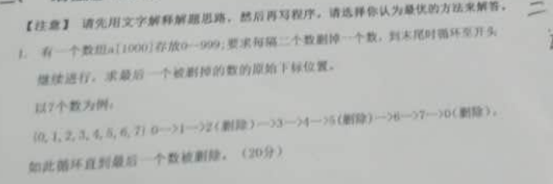
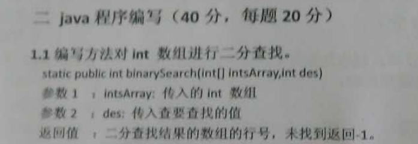
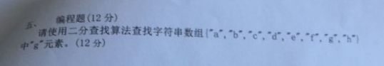
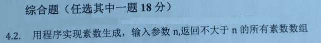
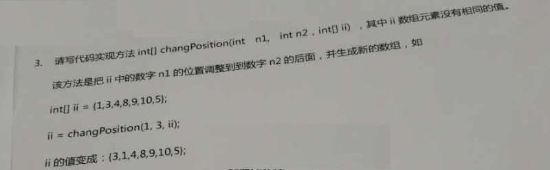

# day16_课后练习

## 1、编程题

有一个数组a[1000]存放0-999，要求每隔二个数删掉一个数，到末尾时循环至开头，继续运行。求最后一个被删掉的数的原始下标位置。

以8个数为例：

{0,1,2,3,4,5,6,7}：0->1->2（删掉）->3->4->5（删掉）->6->7->0（删掉）。。。

## 2、编程题

## 3、编程题

## 4、编程题

## 5、编程题

## 6、编程题

